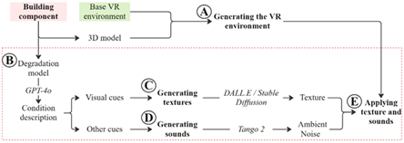

# Gen-AI-based VR Asset Generator

This work is based on a framework presented in ***"Generative Artificial Intelligence and Virtual Reality: Emerging Future of the Building Component Inspection Training"*** during CIB WBC 2025.
This framework combines generative artificial intelligence (Gen AI) and virtual reality (VR) to create a more immersive training environment and help building maintenance and operations. Traditional training methods rely on limited visuals and text, restricting inspectors’ exposure to varied building conditions and hindering their preparedness. The proposed solution uses Gen AI to generate realistic textures of deteriorating components and integrates them into an interactive VR environment. This allows trainees to practice identifying and assessing conditions in a hands-on, immersive setting. The approach aims to reduce subjectivity in inspections and improve knowledge transfer. A hypothetical case study illustrates the framework’s application, showing its potential not only in building maintenance but also in other fields requiring precise and unbiased evaluations.

## 📦 Installation
Simply run **Gen AI VR.bat** to automatically install all required dependencies.

<pre> Utils/bin.bat </pre>
or its shortcut
<pre> ./Gen AI VR </pre>
## 🚀 Features
Immersive VR Environment: Train in a virtual 3D facility built on BIM models.
* AI-Generated Defects: Realistic textures (e.g., rust, cracks, scaling) created using Stable Diffusion and other diffusion models.
* Auditory Feedback: Simulated component sounds (e.g., rattling, bubbling, humming) using AI-generated audio via models like Tango 2. **(⚠️ UNDER DEVELOPMENT)**
* Interactive Inspection Tools: Simulate walkthroughs, identify defects, and rate conditions.
* Dynamic Scenarios: Experience component degradation across different time intervals.  **(⚠️ UNDER DEVELOPMENT)**
* Scalable Framework: Easily extendable to new building systems or sectors such as transportation and industrial equipment.
## 🎓 Use Case
This tool is designed primarily for:
* Civil and Environmental Engineering students
* Professional facility inspectors
* Researchers in AI + Built Environment
* Training institutions focused on infrastructure maintenance
It supports real-time interaction with deteriorating building components like pipes, boilers, HVAC systems, and helps users learn how to objectively assess their condition.

## 📋 Technologies Used
* Stable Diffusion / DALL·E – for generating high-fidelity defect textures
* Tango 2 – for creating AI-generated component audio
* GPT-4o / LLMs – to create realistic prompts and simulate condition reports
* BIM Models (.ifc, .dae, and .glb) – for accurate 3D representations of facilities
  
## 👨‍💼 Team

* **Juyeong Choi** 1 – [jchoi@eng.famu.fsu.edu]<mailto:jchoi@eng.famu.fsu.edu>
* **Mohammad Movahedi** 1 – [mmovahedi@fsu.edu](mailto:mmovahedi@fsu.edu)
* **Carlos Geronimo Bravo** 2 – [cgb22h@fsu.edu]<mailto:cgb22h@fsu.edu>
* **Brandon Pina** 2 – [bp22c@fsu.edu]<mailto:bp22c@fsu.edu>
* **Leonardo Do Nascimento** 2 – [lmd22j@fsu.edu]<mailto:lmd22j@fsu.edu>

1 Department of Civil and Environmental Engineering, FAMU-FSU College of Engineering, Tallahassee, FL, USA

2 Department of Computer Science, Florida State University, Tallahassee, FL, USA.

## ❓ Questions?

If you have any questions, suggestions, or need support, please feel free to contact:

**Mohammad Movahedi**  
📧 [mmovahedi@fsu.edu](mailto:mmovahedi@fsu.edu)

## 📄 License

This project is licensed under a **Custom Non-Commercial License**.  
It is free for personal, academic, and research use.  
**Commercial use is prohibited without explicit permission from the author.**

See the [LICENSE](LICENSE) file for full terms.

## Publication
Research based on the paper:

Movahedi, M., Bravo, C. and Choi, J. (2025) ***"Generative Artificial Intelligence and Virtual Reality: Emerging Future of the Building Component Inspection Training"***, in 23rd CIB World Building Congress.
